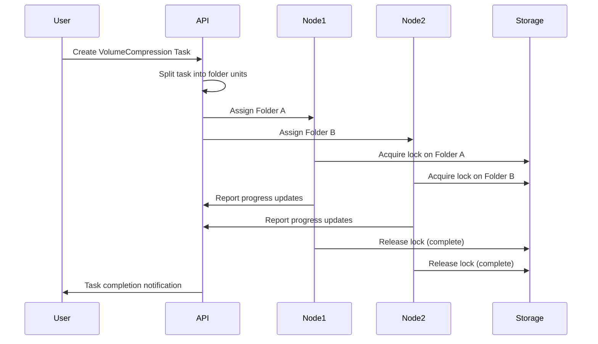
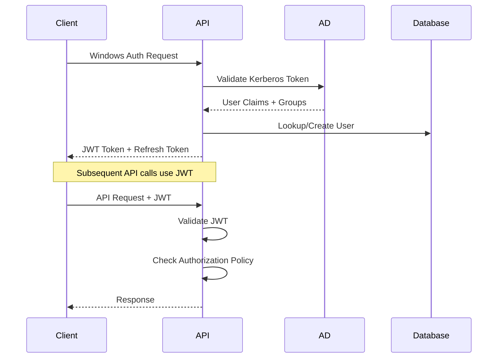

# VCDevTool v2.0 - Project Specification & Migration Guide

> **Complete rebuild specification based on analysis of existing VCDevTool codebase**  
> **Generated:** December 17, 2024  
> **Status:** Planning & Architecture Phase

---

## 📋 **Executive Summary**

VCDevTool v2.0 is a complete ground-up rebuild of the distributed Visual Computing task processing system. The current codebase has accumulated significant technical debt (2,700+ line god classes, duplicate systems, 52 PowerShell scripts) that makes maintenance prohibitive. This specification outlines a modern, clean architecture that preserves all business functionality while eliminating technical debt.

**Key Goals:**
- ✅ Preserve all existing business functionality
- ✅ Eliminate architectural anti-patterns and technical debt
- ✅ Implement modern, maintainable architecture
- ✅ Reduce development and maintenance overhead by 70%
- ✅ Enable horizontal scaling and cloud deployment

---

## 🎯 **Business Domain Analysis**

### **Core Purpose**
VCDevTool is an enterprise-grade distributed file processing system for **Visual Computing workflows** - specifically 3D modeling, rendering, and media production pipelines. It coordinates compute-intensive tasks across multiple Windows workstations with sophisticated file locking to prevent conflicts.

### **Primary Users**
- **Media Production Teams**: Artists, modelers, technical staff processing 3D content
- **System Administrators**: IT staff managing distributed processing infrastructure  
- **Processing Nodes**: Automated computer systems executing tasks

### **Business Value**
- **Parallel Processing**: Reduce processing time by 80% through distributed computing
- **Conflict Prevention**: File locking eliminates data corruption from concurrent access
- **Enterprise Integration**: Seamless Active Directory and existing infrastructure integration
- **Workflow Automation**: Reduce manual task coordination overhead

---

## 🏗️ **Core Features & Workflows**

### **1. Distributed Task Processing**

#### **Task Types**
```csharp
public enum TaskType 
{
    VolumeCompression = 1,    // Primary: VDB file compression for 3D volumes
    RealityCapture = 2,       // Photogrammetry processing  
    PackageTask = 3,          // Pairs .fbx/.e3d files for 3D workflows
    RenderThumbnails = 4,     // Image/model thumbnail generation
    FileProcessing = 5,       // Generic file operations
    MaterialScanning = 6,     // Template-based material processing
    CustomTool = 7            // External tool integration
}
```

#### **Processing Workflow**


### **2. Node Management System**

#### **Node Registration & Health**
- **Hardware Fingerprinting**: Unique identification using CPU/motherboard data
- **Automatic Discovery**: Nodes self-register on network
- **Health Monitoring**: Heartbeat system with 30-second intervals
- **Capability Reporting**: Node advertises available tools and resources
- **Graceful Failure**: Failed nodes don't impact other processing

#### **Node Lifecycle**
```
Registration → Authentication → Task Assignment → Processing → Reporting → Cleanup
```

### **3. Advanced File Locking**

#### **Lock Hierarchy**
- **Task-level**: Prevents duplicate task assignment
- **Folder-level**: Primary locking mechanism for processing
- **File-level**: Granular locks for specific operations
- **Hierarchical**: Parent locks block child operations

#### **Lock Management**
- **Timeout Handling**: Automatic stale lock cleanup (10-minute default)
- **Deadlock Prevention**: Ordered lock acquisition
- **Recovery**: Orphaned lock detection and cleanup
- **Monitoring**: Real-time lock status dashboard

### **4. Real-time Communication**

#### **SignalR Hubs**
- **TaskHub**: Real-time task status updates
- **NodeHub**: Node health and availability changes
- **ProgressHub**: Granular progress reporting
- **DebugHub**: Live system diagnostics

#### **Event Broadcasting**
```typescript
// Client-side event handling
taskHub.on('TaskStarted', (taskId, nodeId) => updateUI());
taskHub.on('ProgressUpdate', (taskId, folderId, progress) => updateProgress());
taskHub.on('TaskCompleted', (taskId, result) => showNotification());
```

---

## 💾 **Data Models & Architecture**

### **Domain Entities**

#### **Task Management**
```csharp
public class Task
{
    public int Id { get; init; }
    public TaskType Type { get; init; }
    public TaskStatus Status { get; set; }
    public string Name { get; init; }
    public TaskParameters Parameters { get; init; }
    public List<string> AssignedNodeIds { get; set; }
    public DateTime CreatedAt { get; init; }
    public DateTime? StartedAt { get; set; }
    public DateTime? CompletedAt { get; set; }
    public TaskResult? Result { get; set; }
    
    // Navigation properties
    public List<FolderProgress> FolderProgress { get; set; }
    public List<TaskEvent> Events { get; set; }
}

public class FolderProgress  
{
    public int Id { get; init; }
    public int TaskId { get; init; }
    public string FolderPath { get; init; }
    public string FolderName { get; init; }
    public ProcessingStatus Status { get; set; }
    public double ProgressPercentage { get; set; }
    public string? AssignedNodeId { get; set; }
    public DateTime? StartedAt { get; set; }
    public DateTime? CompletedAt { get; set; }
    public string? ErrorMessage { get; set; }
    public string? OutputPath { get; set; }
}

public enum TaskStatus
{
    Pending = 0,
    Assigned = 1, 
    Running = 2,
    Completed = 3,
    Failed = 4,
    Cancelled = 5,
    Paused = 6
}

public enum ProcessingStatus
{
    Pending = 0,
    InProgress = 1,
    Completed = 2, 
    Failed = 3,
    Skipped = 4,
    Cancelled = 5
}
```

#### **Node Management**
```csharp
public class Node
{
    public string Id { get; init; }  // Hardware fingerprint
    public string Name { get; init; }
    public string IpAddress { get; set; }
    public NodeStatus Status { get; set; }
    public DateTime LastHeartbeat { get; set; }
    public NodeCapabilities Capabilities { get; set; }
    
    // Active Directory Integration
    public string? ActiveDirectoryName { get; set; }
    public List<string> AdGroups { get; set; }
    public string? ServicePrincipalName { get; set; }
    public DateTime? LastAdSync { get; set; }
    
    // Performance Metrics
    public NodeMetrics CurrentMetrics { get; set; }
    
    // Navigation properties
    public List<Task> AssignedTasks { get; set; }
    public List<FileLock> HeldLocks { get; set; }
}

public class NodeCapabilities
{
    public List<TaskType> SupportedTaskTypes { get; set; }
    public Dictionary<string, string> InstalledTools { get; set; }
    public SystemResources Resources { get; set; }
    public List<string> SupportedFileTypes { get; set; }
}

public class SystemResources
{
    public int CpuCores { get; set; }
    public long MemoryGB { get; set; }
    public long DiskSpaceGB { get; set; }
    public string OperatingSystem { get; set; }
    public string Architecture { get; set; }
}

public enum NodeStatus  
{
    Offline = 0,
    Online = 1,
    Busy = 2,
    Maintenance = 3,
    Error = 4
}
```

#### **File Locking System**
```csharp
public class FileLock
{
    public int Id { get; init; }
    public string ResourcePath { get; init; }
    public LockType Type { get; init; }
    public string LockingNodeId { get; init; }
    public DateTime AcquiredAt { get; init; }
    public DateTime LastRenewed { get; set; }
    public DateTime? ReleasedAt { get; set; }
    public LockStatus Status { get; set; }
    public string? TaskId { get; init; }
    
    // Navigation properties
    public Node LockingNode { get; set; }
    public Task? RelatedTask { get; set; }
}

public enum LockType
{
    Task = 0,
    Folder = 1, 
    File = 2
}

public enum LockStatus
{
    Active = 0,
    Expired = 1,
    Released = 2,
    Orphaned = 3
}
```

### **Clean Architecture Layers**

```
┌─────────────────────────────────────┐
│           Presentation              │
│  ┌─────────────┐  ┌─────────────┐   │
│  │   Web API   │  │  Admin UI   │   │
│  │ Controllers │  │   React     │   │
│  └─────────────┘  └─────────────┘   │
└─────────────────────────────────────┘
                    │
┌─────────────────────────────────────┐
│            Application              │
│  ┌─────────────┐  ┌─────────────┐   │
│  │   Command   │  │    Query    │   │
│  │  Handlers   │  │  Handlers   │   │
│  └─────────────┘  └─────────────┘   │
│  ┌─────────────┐  ┌─────────────┐   │
│  │  Services   │  │ Validation  │   │
│  └─────────────┘  └─────────────┘   │
└─────────────────────────────────────┘
                    │
┌─────────────────────────────────────┐
│              Domain                 │
│  ┌─────────────┐  ┌─────────────┐   │
│  │  Entities   │  │   Values    │   │
│  └─────────────┘  └─────────────┘   │
│  ┌─────────────┐  ┌─────────────┐   │
│  │  Services   │  │   Events    │   │
│  └─────────────┘  └─────────────┘   │
└─────────────────────────────────────┘
                    │
┌─────────────────────────────────────┐
│           Infrastructure            │
│  ┌─────────────┐  ┌─────────────┐   │
│  │ Data Access │  │ External    │   │
│  │     EF      │  │ Services    │   │
│  └─────────────┘  └─────────────┘   │
└─────────────────────────────────────┘
```

---

## 🔧 **Technical Architecture**

### **Backend Technology Stack**

#### **Core Framework**
- **.NET 8.0**: Latest LTS version for stability
- **ASP.NET Core Web API**: RESTful API with OpenAPI documentation
- **Entity Framework Core 8**: Database ORM with PostgreSQL provider
- **MediatR**: CQRS pattern implementation for clean separation
- **FluentValidation**: Type-safe validation with clear error messages
- **AutoMapper**: Object-to-object mapping for DTOs

#### **Communication & Real-time**
- **SignalR**: Real-time bidirectional communication
- **Microsoft.AspNetCore.SignalR.Client**: Client-side connection
- **BackgroundService**: Long-running task coordination
- **IHostedService**: Node health monitoring and cleanup

#### **Security & Authentication**
- **Microsoft.AspNetCore.Authentication.JwtBearer**: API authentication
- **Microsoft.AspNetCore.Authentication.Negotiate**: Windows authentication
- **Microsoft.AspNetCore.Authorization**: Role-based access control
- **System.DirectoryServices**: Active Directory integration

#### **Infrastructure**
- **Serilog**: Structured logging with multiple sinks
- **HealthChecks**: Comprehensive system health monitoring
- **Polly**: Resilience patterns (retry, circuit breaker, timeout)
- **Memory/Redis Caching**: Performance optimization

### **Database Design**

#### **PostgreSQL Schema**
```sql
-- Core Tables
CREATE TABLE nodes (
    id VARCHAR(64) PRIMARY KEY,
    name VARCHAR(256) NOT NULL,
    ip_address INET,
    status INTEGER NOT NULL DEFAULT 0,
    last_heartbeat TIMESTAMP WITH TIME ZONE,
    capabilities JSONB,
    ad_info JSONB,
    created_at TIMESTAMP WITH TIME ZONE DEFAULT NOW(),
    updated_at TIMESTAMP WITH TIME ZONE DEFAULT NOW()
);

CREATE TABLE tasks (
    id SERIAL PRIMARY KEY,
    name VARCHAR(512) NOT NULL,
    type INTEGER NOT NULL,
    status INTEGER NOT NULL DEFAULT 0,
    parameters JSONB,
    assigned_node_ids TEXT[],
    created_at TIMESTAMP WITH TIME ZONE DEFAULT NOW(),
    started_at TIMESTAMP WITH TIME ZONE,
    completed_at TIMESTAMP WITH TIME ZONE,
    result JSONB,
    version INTEGER DEFAULT 1
);

CREATE TABLE folder_progress (
    id SERIAL PRIMARY KEY,
    task_id INTEGER REFERENCES tasks(id) ON DELETE CASCADE,
    folder_path VARCHAR(1024) NOT NULL,
    folder_name VARCHAR(256) NOT NULL,
    status INTEGER NOT NULL DEFAULT 0,
    progress_percentage DECIMAL(5,2) DEFAULT 0.00,
    assigned_node_id VARCHAR(64) REFERENCES nodes(id),
    started_at TIMESTAMP WITH TIME ZONE,
    completed_at TIMESTAMP WITH TIME ZONE,
    error_message TEXT,
    output_path VARCHAR(1024)
);

CREATE TABLE file_locks (
    id SERIAL PRIMARY KEY,
    resource_path VARCHAR(1024) NOT NULL,
    lock_type INTEGER NOT NULL,
    locking_node_id VARCHAR(64) REFERENCES nodes(id),
    task_id INTEGER REFERENCES tasks(id),
    acquired_at TIMESTAMP WITH TIME ZONE DEFAULT NOW(),
    last_renewed TIMESTAMP WITH TIME ZONE DEFAULT NOW(),
    released_at TIMESTAMP WITH TIME ZONE,
    status INTEGER NOT NULL DEFAULT 0
);

-- Indexes for performance
CREATE INDEX idx_tasks_status ON tasks(status);
CREATE INDEX idx_tasks_assigned_nodes ON tasks USING GIN(assigned_node_ids);
CREATE INDEX idx_folder_progress_task ON folder_progress(task_id);
CREATE INDEX idx_folder_progress_status ON folder_progress(status);
CREATE INDEX idx_file_locks_node ON file_locks(locking_node_id);
CREATE INDEX idx_file_locks_resource ON file_locks(resource_path);
CREATE INDEX idx_nodes_status ON nodes(status);
CREATE INDEX idx_nodes_heartbeat ON nodes(last_heartbeat);

-- Unique constraints
CREATE UNIQUE INDEX idx_file_locks_active ON file_locks(resource_path) 
WHERE status = 0;
```

### **API Design**

#### **RESTful Endpoints**
```csharp
// Task Management
[ApiController]
[Route("api/v2/tasks")]
public class TasksController : ControllerBase
{
    [HttpGet]
    public async Task<ActionResult<PagedResult<TaskDto>>> GetTasks(
        [FromQuery] TaskQueryParameters query);
    
    [HttpGet("{id:int}")]
    public async Task<ActionResult<TaskDetailDto>> GetTask(int id);
    
    [HttpPost]
    public async Task<ActionResult<TaskDto>> CreateTask(
        [FromBody] CreateTaskCommand command);
    
    [HttpPut("{id:int}/status")]
    public async Task<ActionResult> UpdateTaskStatus(
        int id, [FromBody] UpdateTaskStatusCommand command);
    
    [HttpDelete("{id:int}")]
    public async Task<ActionResult> CancelTask(int id);
    
    [HttpGet("{id:int}/progress")]
    public async Task<ActionResult<List<FolderProgressDto>>> GetTaskProgress(int id);
}

// Node Management  
[ApiController]
[Route("api/v2/nodes")]
public class NodesController : ControllerBase
{
    [HttpGet]
    public async Task<ActionResult<List<NodeDto>>> GetNodes();
    
    [HttpPost("register")]
    public async Task<ActionResult<NodeDto>> RegisterNode(
        [FromBody] RegisterNodeCommand command);
    
    [HttpPost("{id}/heartbeat")]
    public async Task<ActionResult> SendHeartbeat(string id);
    
    [HttpPut("{id}/capabilities")]
    public async Task<ActionResult> UpdateCapabilities(
        string id, [FromBody] NodeCapabilities capabilities);
}

// File Lock Management
[ApiController]
[Route("api/v2/locks")]
public class LocksController : ControllerBase
{
    [HttpPost("acquire")]
    public async Task<ActionResult<LockResult>> AcquireLock(
        [FromBody] AcquireLockCommand command);
    
    [HttpPost("release")]
    public async Task<ActionResult> ReleaseLock(
        [FromBody] ReleaseLockCommand command);
    
    [HttpGet("active")]
    public async Task<ActionResult<List<FileLockDto>>> GetActiveLocks();
    
    [HttpDelete("cleanup")]
    public async Task<ActionResult> CleanupStaleLocks();
}
```

#### **CQRS Command/Query Separation**
```csharp
// Commands (Write operations)
public record CreateTaskCommand(
    string Name,
    TaskType Type,
    TaskParameters Parameters,
    List<string> TargetPaths
) : IRequest<int>;

public record UpdateTaskStatusCommand(
    TaskStatus Status,
    string? ResultMessage = null,
    int Version = 1
) : IRequest;

// Queries (Read operations)
public record GetTasksQuery(
    TaskStatus? Status = null,
    TaskType? Type = null,
    string? AssignedNodeId = null,
    int Page = 1,
    int PageSize = 50
) : IRequest<PagedResult<TaskDto>>;

public record GetTaskDetailQuery(int TaskId) : IRequest<TaskDetailDto>;
```

### **SignalR Real-time Communication**

#### **Hub Definitions**
```csharp
[Authorize]
public class TaskHub : Hub
{
    public async Task JoinTaskGroup(int taskId)
    {
        await Groups.AddToGroupAsync(Context.ConnectionId, $"task-{taskId}");
    }
    
    public async Task LeaveTaskGroup(int taskId) 
    {
        await Groups.RemoveFromGroupAsync(Context.ConnectionId, $"task-{taskId}");
    }
}

[Authorize(Roles = "Node")]
public class NodeHub : Hub
{
    public async Task RegisterNode(string nodeId)
    {
        await Groups.AddToGroupAsync(Context.ConnectionId, "nodes");
        await Groups.AddToGroupAsync(Context.ConnectionId, $"node-{nodeId}");
    }
}

// Event Broadcasting Service
public class EventBroadcastService
{
    private readonly IHubContext<TaskHub> _taskHub;
    private readonly IHubContext<NodeHub> _nodeHub;
    
    public async Task BroadcastTaskStarted(int taskId, string nodeId)
    {
        await _taskHub.Clients.Group($"task-{taskId}")
            .SendAsync("TaskStarted", taskId, nodeId);
    }
    
    public async Task BroadcastProgressUpdate(int taskId, int folderId, double progress)
    {
        await _taskHub.Clients.Group($"task-{taskId}")
            .SendAsync("ProgressUpdate", taskId, folderId, progress);
    }
}
```

---

## 🎨 **Frontend Architecture**

### **Technology Options**

#### **Option A: React Admin Dashboard + .NET MAUI Client**
```
Admin Interface (Web)     Desktop Client (Cross-platform)
┌─────────────────────┐   ┌─────────────────────┐
│   React + TypeScript│   │    .NET MAUI        │
│   ├─ Material-UI    │   │    ├─ MVVM          │
│   ├─ React Query    │   │    ├─ SignalR       │
│   ├─ React Router   │   │    ├─ RestSharp     │
│   └─ SignalR Client │   │    └─ Native APIs   │
└─────────────────────┘   └─────────────────────┘
```

#### **Option B: Full React with Electron Desktop**
```
Unified Frontend Architecture
┌─────────────────────────────────┐
│        React Ecosystem         │
│   ┌─────────────────────────┐   │
│   │    Core React App      │   │
│   │  ├─ TypeScript         │   │
│   │  ├─ Redux Toolkit      │   │
│   │  ├─ React Query        │   │
│   │  └─ Material-UI        │   │
│   └─────────────────────────┘   │
│                                 │
│   ┌──────────┐  ┌──────────┐    │
│   │   Web    │  │ Electron │    │
│   │ (Admin)  │  │ (Nodes)  │    │
│   └──────────┘  └──────────┘    │
└─────────────────────────────────┘
```

### **React Admin Dashboard Features**

#### **Core Components**
```typescript
// Dashboard Layout
interface DashboardLayout {
  header: AppHeader;
  sidebar: NavigationSidebar;
  main: RouterOutlet;
  notifications: NotificationCenter;
}

// Key Pages
const routes = [
  { path: '/dashboard', component: DashboardOverview },
  { path: '/tasks', component: TaskManagement },
  { path: '/nodes', component: NodeManagement },
  { path: '/locks', component: LockManagement },
  { path: '/monitoring', component: SystemMonitoring },
  { path: '/settings', component: SystemSettings }
];

// Real-time Data Hooks
export const useTaskProgress = (taskId: number) => {
  const [progress, setProgress] = useState<TaskProgress[]>([]);
  
  useEffect(() => {
    const connection = new HubConnectionBuilder()
      .withUrl('/taskHub')
      .build();
      
    connection.start().then(() => {
      connection.invoke('JoinTaskGroup', taskId);
      connection.on('ProgressUpdate', (taskId, folderId, progress) => {
        setProgress(prev => updateProgress(prev, folderId, progress));
      });
    });
    
    return () => connection.stop();
  }, [taskId]);
  
  return progress;
};
```

#### **Task Management Interface**
```typescript
// Task Creation Wizard
interface CreateTaskWizard {
  steps: [
    TaskTypeSelection,
    DirectorySelection, 
    ParameterConfiguration,
    NodeAssignment,
    ReviewAndSubmit
  ];
}

// Real-time Task Monitoring  
const TaskMonitoring: React.FC = () => {
  const { data: tasks } = useQuery(['tasks'], fetchActiveTasks);
  const taskProgress = useTaskProgress(selectedTaskId);
  
  return (
    <Grid container spacing={2}>
      <Grid item xs={12} md={8}>
        <TaskList tasks={tasks} onSelect={setSelectedTask} />
      </Grid>
      <Grid item xs={12} md={4}>
        <TaskDetails task={selectedTask} progress={taskProgress} />
      </Grid>
    </Grid>
  );
};

// Node Status Dashboard
const NodeDashboard: React.FC = () => {
  const { data: nodes } = useQuery(['nodes'], fetchNodes);
  const nodeStatuses = useNodeStatuses();
  
  return (
    <Box>
      <NodeStatusGrid nodes={nodes} statuses={nodeStatuses} />
      <NodePerformanceCharts data={performanceData} />
      <ActiveTasksByNode nodes={nodes} />
    </Box>
  );
};
```

### **Desktop Client (.NET MAUI)**

#### **MVVM Architecture**
```csharp
// Main View Model
public class MainViewModel : BaseViewModel
{
    private readonly ITaskService _taskService;
    private readonly IHubService _hubService;
    
    public ObservableCollection<TaskViewModel> Tasks { get; }
    public ObservableCollection<NodeViewModel> Nodes { get; }
    
    public ICommand CreateTaskCommand { get; }
    public ICommand CancelTaskCommand { get; }
    public ICommand RefreshCommand { get; }
    
    public async Task InitializeAsync()
    {
        await _hubService.ConnectAsync();
        await LoadDataAsync();
        
        _hubService.TaskStarted += OnTaskStarted;
        _hubService.ProgressUpdated += OnProgressUpdated;
    }
}

// Task View Model
public class TaskViewModel : BaseViewModel
{
    private TaskStatus _status;
    private double _progress;
    
    public string Name { get; init; }
    public TaskType Type { get; init; }
    public TaskStatus Status 
    { 
        get => _status; 
        set => SetProperty(ref _status, value); 
    }
    
    public double Progress 
    { 
        get => _progress; 
        set => SetProperty(ref _progress, value); 
    }
    
    public ObservableCollection<FolderProgressViewModel> FolderProgress { get; }
    
    public bool CanCancel => Status == TaskStatus.Running || Status == TaskStatus.Assigned;
}
```

#### **Real-time Updates**
```csharp
// SignalR Hub Service
public class HubService : IHubService
{
    private HubConnection? _connection;
    
    public event EventHandler<TaskStartedEventArgs>? TaskStarted;
    public event EventHandler<ProgressUpdatedEventArgs>? ProgressUpdated;
    
    public async Task ConnectAsync()
    {
        _connection = new HubConnectionBuilder()
            .WithUrl("https://api.vcdevtool.com/taskHub")
            .WithAutomaticReconnect()
            .Build();
            
        _connection.On<int, string>("TaskStarted", OnTaskStarted);
        _connection.On<int, int, double>("ProgressUpdate", OnProgressUpdated);
        
        await _connection.StartAsync();
    }
    
    private void OnTaskStarted(int taskId, string nodeId)
    {
        TaskStarted?.Invoke(this, new TaskStartedEventArgs(taskId, nodeId));
    }
}
```

---

## 🚀 **Infrastructure & Deployment**

### **Containerized Architecture**

#### **Docker Compose Production Stack**
```yaml
version: '3.8'

services:
  # Core API Service
  api:
    build:
      context: ./backend
      dockerfile: VCDevTool.API/Dockerfile
    environment:
      - ASPNETCORE_ENVIRONMENT=Production
      - ConnectionStrings__DefaultConnection=Host=database;Database=vcdevtool;Username=vcdevtool;Password=${DB_PASSWORD}
      - JwtSettings__SecretKey=${JWT_SECRET}
      - ActiveDirectory__Domain=${AD_DOMAIN}
    ports:
      - "5000:80"
    depends_on:
      - database
      - redis
    volumes:
      - app_logs:/app/logs
      - shared_storage:/app/shared
    restart: unless-stopped
    healthcheck:
      test: ["CMD", "curl", "-f", "http://localhost/health"]
      interval: 30s
      timeout: 10s
      retries: 3

  # PostgreSQL Database
  database:
    image: postgres:15-alpine
    environment:
      - POSTGRES_DB=vcdevtool
      - POSTGRES_USER=vcdevtool
      - POSTGRES_PASSWORD=${DB_PASSWORD}
    ports:
      - "5432:5432"
    volumes:
      - postgres_data:/var/lib/postgresql/data
      - ./infrastructure/sql/init.sql:/docker-entrypoint-initdb.d/init.sql
    restart: unless-stopped
    healthcheck:
      test: ["CMD-SHELL", "pg_isready -U vcdevtool -d vcdevtool"]
      interval: 10s
      timeout: 5s
      retries: 5

  # Redis Cache
  redis:
    image: redis:7-alpine
    ports:
      - "6379:6379"
    volumes:
      - redis_data:/data
    restart: unless-stopped
    healthcheck:
      test: ["CMD", "redis-cli", "ping"]
      interval: 10s
      timeout: 5s
      retries: 3

  # Nginx Reverse Proxy
  nginx:
    image: nginx:alpine
    ports:
      - "80:80"
      - "443:443"
    volumes:
      - ./infrastructure/nginx/nginx.conf:/etc/nginx/nginx.conf
      - ./infrastructure/nginx/ssl:/etc/nginx/ssl
      - admin_dist:/usr/share/nginx/html
    depends_on:
      - api
    restart: unless-stopped

  # Admin Dashboard (Static Files)
  admin:
    build:
      context: ./frontend/admin-dashboard
      dockerfile: Dockerfile
    volumes:
      - admin_dist:/app/dist

volumes:
  postgres_data:
  redis_data:
  app_logs:
  shared_storage:
  admin_dist:

networks:
  default:
    driver: bridge
```

#### **Kubernetes Deployment (Future)**
```yaml
# API Deployment
apiVersion: apps/v1
kind: Deployment
metadata:
  name: vcdevtool-api
spec:
  replicas: 3
  selector:
    matchLabels:
      app: vcdevtool-api
  template:
    metadata:
      labels:
        app: vcdevtool-api
    spec:
      containers:
      - name: api
        image: vcdevtool/api:latest
        ports:
        - containerPort: 80
        env:
        - name: ConnectionStrings__DefaultConnection
          valueFrom:
            secretKeyRef:
              name: vcdevtool-secrets
              key: database-connection
        livenessProbe:
          httpGet:
            path: /health
            port: 80
          initialDelaySeconds: 30
          periodSeconds: 10
        readinessProbe:
          httpGet:
            path: /health/ready
            port: 80
          initialDelaySeconds: 5
          periodSeconds: 5
```

### **Deployment Automation**

#### **PowerShell Deployment Script**
```powershell
# deploy-v2.ps1
param(
    [Parameter(Mandatory=$true)]
    [ValidateSet("Development", "Staging", "Production")]
    [string]$Environment,
    
    [string]$Version = "latest",
    [switch]$SkipTests = $false,
    [switch]$SkipBackup = $false,
    [switch]$DryRun = $false
)

$ErrorActionPreference = "Stop"

function Deploy-VCDevTool {
    Write-Host "🚀 Starting VCDevTool v2.0 Deployment" -ForegroundColor Green
    Write-Host "Environment: $Environment" -ForegroundColor Cyan
    Write-Host "Version: $Version" -ForegroundColor Cyan
    
    # Pre-deployment checks
    Test-Prerequisites
    
    if (-not $SkipTests) {
        Run-Tests
    }
    
    if (-not $SkipBackup -and $Environment -eq "Production") {
        Backup-Production
    }
    
    # Deploy infrastructure
    Deploy-Infrastructure
    
    # Deploy application
    Deploy-Application
    
    # Verify deployment
    Test-Deployment
    
    Write-Host "✅ Deployment completed successfully!" -ForegroundColor Green
}

function Test-Prerequisites {
    Write-Host "🔍 Checking prerequisites..." -ForegroundColor Yellow
    
    # Check Docker
    if (-not (Get-Command docker -ErrorAction SilentlyContinue)) {
        throw "Docker is required but not installed"
    }
    
    # Check Docker Compose
    if (-not (Get-Command docker-compose -ErrorAction SilentlyContinue)) {
        throw "Docker Compose is required but not installed"
    }
    
    # Check environment file
    $envFile = ".env.$Environment"
    if (-not (Test-Path $envFile)) {
        throw "Environment file $envFile not found"
    }
    
    Write-Host "✅ Prerequisites check passed" -ForegroundColor Green
}

function Deploy-Infrastructure {
    Write-Host "🏗️ Deploying infrastructure..." -ForegroundColor Yellow
    
    if ($DryRun) {
        Write-Host "DRY RUN: Would deploy infrastructure" -ForegroundColor Magenta
        return
    }
    
    # Load environment variables
    Get-Content ".env.$Environment" | ForEach-Object {
        if ($_ -match '^([^=]+)=(.*)$') {
            [Environment]::SetEnvironmentVariable($matches[1], $matches[2])
        }
    }
    
    # Deploy with Docker Compose
    docker-compose -f docker-compose.yml -f "docker-compose.$Environment.yml" up -d --build
    
    if ($LASTEXITCODE -ne 0) {
        throw "Infrastructure deployment failed"
    }
    
    # Wait for services to be healthy
    Wait-ForHealthy
    
    Write-Host "✅ Infrastructure deployed successfully" -ForegroundColor Green
}

function Wait-ForHealthy {
    Write-Host "⏳ Waiting for services to become healthy..." -ForegroundColor Yellow
    
    $timeout = 300 # 5 minutes
    $elapsed = 0
    
    do {
        Start-Sleep -Seconds 10
        $elapsed += 10
        
        $unhealthyServices = docker-compose ps --format json | 
            ConvertFrom-Json | 
            Where-Object { $_.Health -ne "healthy" -and $_.Health -ne "" }
        
        if (-not $unhealthyServices) {
            Write-Host "✅ All services are healthy" -ForegroundColor Green
            return
        }
        
        if ($elapsed -ge $timeout) {
            throw "Timeout waiting for services to become healthy"
        }
        
        Write-Host "⏳ Still waiting... ($elapsed/$timeout seconds)" -ForegroundColor Yellow
    } while ($true)
}

# Execute deployment
Deploy-VCDevTool
```

#### **GitHub Actions CI/CD**
```yaml
name: VCDevTool v2.0 CI/CD

on:
  push:
    branches: [ main, develop ]
  pull_request:
    branches: [ main ]

jobs:
  test:
    runs-on: ubuntu-latest
    
    services:
      postgres:
        image: postgres:15
        env:
          POSTGRES_PASSWORD: test_password
          POSTGRES_DB: vcdevtool_test
        options: >-
          --health-cmd pg_isready
          --health-interval 10s
          --health-timeout 5s
          --health-retries 5
    
    steps:
    - uses: actions/checkout@v4
    
    - name: Setup .NET
      uses: actions/setup-dotnet@v3
      with:
        dotnet-version: '8.0.x'
    
    - name: Restore dependencies
      run: dotnet restore
    
    - name: Build
      run: dotnet build --no-restore
    
    - name: Test
      run: dotnet test --no-build --verbosity normal --collect:"XPlat Code Coverage"
    
    - name: Upload coverage reports
      uses: codecov/codecov-action@v3

  build-and-deploy:
    needs: test
    runs-on: ubuntu-latest
    if: github.ref == 'refs/heads/main'
    
    steps:
    - uses: actions/checkout@v4
    
    - name: Set up Docker Buildx
      uses: docker/setup-buildx-action@v2
    
    - name: Login to Docker Hub
      uses: docker/login-action@v2
      with:
        username: ${{ secrets.DOCKER_USERNAME }}
        password: ${{ secrets.DOCKER_PASSWORD }}
    
    - name: Build and push API image
      uses: docker/build-push-action@v4
      with:
        context: ./backend
        file: ./backend/VCDevTool.API/Dockerfile
        push: true
        tags: vcdevtool/api:${{ github.sha }},vcdevtool/api:latest
    
    - name: Deploy to staging
      uses: appleboy/ssh-action@v0.1.5
      with:
        host: ${{ secrets.STAGING_HOST }}
        username: ${{ secrets.STAGING_USER }}
        key: ${{ secrets.STAGING_SSH_KEY }}
        script: |
          cd /opt/vcdevtool
          docker-compose pull
          docker-compose up -d
```

---

## 🔒 **Security & Authentication**

### **Multi-layered Security Architecture**

#### **Authentication Flow**


#### **Security Layers**
```csharp
// 1. Authentication Middleware
public class AuthenticationMiddleware
{
    public async Task InvokeAsync(HttpContext context, RequestDelegate next)
    {
        // Try Windows Authentication first
        if (context.User?.Identity?.IsAuthenticated != true)
        {
            var windowsUser = await _windowsAuthService.AuthenticateAsync(context);
            if (windowsUser != null)
            {
                context.User = windowsUser;
            }
        }
        
        // Fallback to JWT
        if (context.User?.Identity?.IsAuthenticated != true)
        {
            await _jwtAuthService.AuthenticateAsync(context);
        }
        
        await next(context);
    }
}

// 2. Authorization Policies
public static class SecurityPolicies
{
    public const string AdminPolicy = "AdminPolicy";
    public const string UserPolicy = "UserPolicy"; 
    public const string NodePolicy = "NodePolicy";
    
    public static void ConfigurePolicies(AuthorizationOptions options)
    {
        options.AddPolicy(AdminPolicy, policy =>
            policy.RequireRole("VCDevTool_Administrators", "Domain Admins"));
            
        options.AddPolicy(UserPolicy, policy =>
            policy.RequireAuthenticatedUser()
                  .RequireRole("VCDevTool_Users", "VCDevTool_Administrators"));
                  
        options.AddPolicy(NodePolicy, policy =>
            policy.RequireAuthenticatedUser()
                  .RequireClaim("node_id")
                  .RequireRole("VCDevTool_ComputerNodes"));
    }
}

// 3. Hardware Fingerprinting
public class NodeIdentityService
{
    public async Task<string> GenerateHardwareFingerprintAsync()
    {
        var components = new[]
        {
            GetCpuId(),
            GetMotherboardSerial(), 
            GetMacAddress(),
            Environment.MachineName
        };
        
        var combined = string.Join("|", components);
        var hash = SHA256.HashData(Encoding.UTF8.GetBytes(combined));
        return Convert.ToBase64String(hash);
    }
    
    public async Task<bool> ValidateNodeIdentityAsync(string nodeId, string fingerprint)
    {
        var node = await _nodeRepository.GetByIdAsync(nodeId);
        return node?.HardwareFingerprint == fingerprint;
    }
}
```

#### **Role-based Access Control**
```csharp
// Authorization Requirements
public class NodeOwnershipRequirement : IAuthorizationRequirement
{
    public string NodeId { get; }
    
    public NodeOwnershipRequirement(string nodeId)
    {
        NodeId = nodeId;
    }
}

public class NodeOwnershipHandler : AuthorizationHandler<NodeOwnershipRequirement>
{
    protected override Task HandleRequirementAsync(
        AuthorizationHandlerContext context,
        NodeOwnershipRequirement requirement)
    {
        var userNodeId = context.User.FindFirst("node_id")?.Value;
        var isAdmin = context.User.IsInRole("VCDevTool_Administrators");
        
        if (isAdmin || userNodeId == requirement.NodeId)
        {
            context.Succeed(requirement);
        }
        
        return Task.CompletedTask;
    }
}

// Usage in Controllers
[HttpPut("{nodeId}/status")]
[Authorize(Policy = SecurityPolicies.NodePolicy)]
public async Task<ActionResult> UpdateNodeStatus(
    string nodeId,
    [FromBody] UpdateNodeStatusCommand command)
{
    // Additional authorization check
    var authResult = await _authorizationService.AuthorizeAsync(
        User, new NodeOwnershipRequirement(nodeId));
        
    if (!authResult.Succeeded)
        return Forbid();
        
    await _mediator.Send(command with { NodeId = nodeId });
    return NoContent();
}
```

### **Data Protection & Privacy**

#### **Sensitive Data Handling**
```csharp
// Data Protection for sensitive configuration
public class SecureConfigurationService
{
    private readonly IDataProtector _protector;
    
    public SecureConfigurationService(IDataProtectionProvider provider)
    {
        _protector = provider.CreateProtector("VCDevTool.Configuration");
    }
    
    public void StoreConnectionString(string connectionString)
    {
        var encrypted = _protector.Protect(connectionString);
        // Store encrypted value
    }
    
    public string GetConnectionString()
    {
        var encrypted = // Retrieve encrypted value
        return _protector.Unprotect(encrypted);
    }
}

// Audit Logging
public class AuditLogService
{
    public async Task LogActionAsync(string userId, string action, object data)
    {
        var auditEntry = new AuditLogEntry
        {
            UserId = userId,
            Action = action,
            Data = JsonSerializer.Serialize(data),
            Timestamp = DateTime.UtcNow,
            IpAddress = _httpContextAccessor.HttpContext?.Connection?.RemoteIpAddress?.ToString()
        };
        
        await _auditRepository.AddAsync(auditEntry);
    }
}
```

---

## 📊 **Monitoring & Observability**

### **Structured Logging**

#### **Serilog Configuration**
```csharp
public static void ConfigureLogging(IHostBuilder hostBuilder)
{
    hostBuilder.UseSerilog((context, configuration) =>
    {
        configuration
            .ReadFrom.Configuration(context.Configuration)
            .Enrich.FromLogContext()
            .Enrich.WithMachineName()
            .Enrich.WithThreadId()
            .Enrich.WithProperty("Application", "VCDevTool.API")
            .WriteTo.Console(outputTemplate: 
                "[{Timestamp:HH:mm:ss} {Level:u3}] {Message:lj} {Properties:j}{NewLine}{Exception}")
            .WriteTo.File(
                path: "logs/vcdevtool-.log",
                rollingInterval: RollingInterval.Day,
                retainedFileCountLimit: 30,
                outputTemplate: 
                "[{Timestamp:yyyy-MM-dd HH:mm:ss.fff zzz} {Level:u3}] {Message:lj} {Properties:j}{NewLine}{Exception}")
            .WriteTo.Seq(context.Configuration.GetConnectionString("Seq"))
            .WriteTo.PostgreSQL(
                connectionString: context.Configuration.GetConnectionString("LoggingDatabase"),
                tableName: "system_logs",
                needAutoCreateTable: true);
    });
}

// Structured Logging Usage
public class TaskService
{
    private readonly ILogger<TaskService> _logger;
    
    public async Task<Task> CreateTaskAsync(CreateTaskCommand command)
    {
        using var scope = _logger.BeginScope("Creating task {TaskName} of type {TaskType}", 
            command.Name, command.Type);
            
        _logger.LogInformation("Task creation started for {FolderCount} folders", 
            command.TargetPaths.Count);
            
        try
        {
            var task = await _taskRepository.CreateAsync(command.ToEntity());
            
            _logger.LogInformation("Task {TaskId} created successfully", task.Id);
            
            return task;
        }
        catch (Exception ex)
        {
            _logger.LogError(ex, "Failed to create task {TaskName}", command.Name);
            throw;
        }
    }
}
```

#### **Application Metrics**
```csharp
// Custom Metrics
public class MetricsService
{
    private readonly Counter<int> _tasksCreated;
    private readonly Counter<int> _tasksCompleted;
    private readonly Histogram<double> _taskDuration;
    private readonly Gauge<int> _activeNodes;
    
    public MetricsService(IMeterFactory meterFactory)
    {
        var meter = meterFactory.Create("VCDevTool");
        
        _tasksCreated = meter.CreateCounter<int>("tasks_created_total");
        _tasksCompleted = meter.CreateCounter<int>("tasks_completed_total");
        _taskDuration = meter.CreateHistogram<double>("task_duration_seconds");
        _activeNodes = meter.CreateObservableGauge<int>("active_nodes", GetActiveNodeCount);
    }
    
    public void RecordTaskCreated(TaskType type) =>
        _tasksCreated.Add(1, new KeyValuePair<string, object?>("task_type", type.ToString()));
        
    public void RecordTaskCompleted(TaskType type, TaskStatus status, TimeSpan duration)
    {
        _tasksCompleted.Add(1, 
            new KeyValuePair<string, object?>("task_type", type.ToString()),
            new KeyValuePair<string, object?>("status", status.ToString()));
            
        _taskDuration.Record(duration.TotalSeconds,
            new KeyValuePair<string, object?>("task_type", type.ToString()));
    }
}

// Health Checks
public class DatabaseHealthCheck : IHealthCheck
{
    private readonly AppDbContext _context;
    
    public async Task<HealthCheckResult> CheckHealthAsync(
        HealthCheckContext context, 
        CancellationToken cancellationToken = default)
    {
        try
        {
            await _context.Database.ExecuteSqlRawAsync("SELECT 1", cancellationToken);
            return HealthCheckResult.Healthy("Database connection is healthy");
        }
        catch (Exception ex)
        {
            return HealthCheckResult.Unhealthy("Database connection failed", ex);
        }
    }
}
```

### **Performance Monitoring**

#### **Application Performance Monitoring**
```csharp
// Performance Tracking Middleware
public class PerformanceMiddleware
{
    private readonly RequestDelegate _next;
    private readonly ILogger<PerformanceMiddleware> _logger;
    private readonly DiagnosticSource _diagnosticSource;
    
    public async Task InvokeAsync(HttpContext context)
    {
        var stopwatch = Stopwatch.StartNew();
        
        try
        {
            await _next(context);
        }
        finally
        {
            stopwatch.Stop();
            
            var elapsed = stopwatch.ElapsedMilliseconds;
            
            if (elapsed > 1000) // Log slow requests
            {
                _logger.LogWarning("Slow request: {Method} {Path} took {ElapsedMs}ms",
                    context.Request.Method,
                    context.Request.Path,
                    elapsed);
            }
            
            // Record metrics
            _diagnosticSource.Write("VCDevTool.Request.Duration", new
            {
                HttpContext = context,
                Duration = stopwatch.Elapsed
            });
        }
    }
}

// System Resource Monitoring
public class SystemResourceMonitor : BackgroundService
{
    private readonly ILogger<SystemResourceMonitor> _logger;
    private readonly IServiceProvider _serviceProvider;
    
    protected override async Task ExecuteAsync(CancellationToken stoppingToken)
    {
        while (!stoppingToken.IsCancellationRequested)
        {
            try
            {
                var metrics = await GatherSystemMetricsAsync();
                
                using var scope = _serviceProvider.CreateScope();
                var metricsService = scope.ServiceProvider.GetRequiredService<MetricsService>();
                
                metricsService.RecordSystemMetrics(metrics);
                
                await Task.Delay(TimeSpan.FromSeconds(30), stoppingToken);
            }
            catch (Exception ex)
            {
                _logger.LogError(ex, "Error gathering system metrics");
            }
        }
    }
}
```

---

## 🧪 **Testing Strategy**

### **Test Architecture**

#### **Testing Pyramid**
```
                    ┌─────────────────┐
                    │   E2E Tests     │ ← 10%
                    │   (Playwright)  │
                    └─────────────────┘
               ┌─────────────────────────┐
               │  Integration Tests      │ ← 20%
               │  (WebApplicationFactory)│
               └─────────────────────────┘
          ┌─────────────────────────────────┐
          │        Unit Tests               │ ← 70%
          │   (xUnit + NSubstitute)         │
          └─────────────────────────────────┘
```

#### **Unit Test Examples**
```csharp
// Domain Logic Tests
public class TaskServiceTests
{
    private readonly ITaskRepository _taskRepository = Substitute.For<ITaskRepository>();
    private readonly IEventBroadcastService _eventService = Substitute.For<IEventBroadcastService>();
    private readonly TaskService _taskService;
    
    public TaskServiceTests()
    {
        _taskService = new TaskService(_taskRepository, _eventService);
    }
    
    [Fact]
    public async Task CreateTaskAsync_WithValidCommand_ShouldCreateTask()
    {
        // Arrange
        var command = new CreateTaskCommand(
            Name: "Test Task",
            Type: TaskType.VolumeCompression,
            Parameters: new TaskParameters(),
            TargetPaths: new[] { "/test/path" }
        );
        
        var expectedTask = new Task 
        { 
            Id = 1, 
            Name = command.Name, 
            Type = command.Type 
        };
        
        _taskRepository.CreateAsync(Arg.Any<Task>()).Returns(expectedTask);
        
        // Act
        var result = await _taskService.CreateTaskAsync(command);
        
        // Assert
        result.Should().NotBeNull();
        result.Name.Should().Be(command.Name);
        result.Type.Should().Be(command.Type);
        
        await _taskRepository.Received(1).CreateAsync(Arg.Any<Task>());
        await _eventService.Received(1).BroadcastTaskCreated(expectedTask.Id);
    }
    
    [Theory]
    [InlineData(TaskStatus.Completed)]
    [InlineData(TaskStatus.Failed)]
    [InlineData(TaskStatus.Cancelled)]
    public async Task UpdateTaskStatusAsync_WithFinalStatus_ShouldSetCompletedAt(TaskStatus finalStatus)
    {
        // Arrange
        var task = new Task { Id = 1, Status = TaskStatus.Running };
        var command = new UpdateTaskStatusCommand(finalStatus);
        
        _taskRepository.GetByIdAsync(1).Returns(task);
        
        // Act
        await _taskService.UpdateTaskStatusAsync(1, command);
        
        // Assert
        task.CompletedAt.Should().NotBeNull();
        task.CompletedAt.Should().BeCloseTo(DateTime.UtcNow, TimeSpan.FromSeconds(1));
    }
}

// File Lock Service Tests
public class FileLockServiceTests
{
    [Fact]
    public async Task AcquireLockAsync_WhenNoExistingLock_ShouldSucceed()
    {
        // Arrange
        var command = new AcquireLockCommand(
            ResourcePath: "/test/folder",
            LockType: LockType.Folder,
            NodeId: "node1"
        );
        
        _lockRepository.GetActiveLockAsync(command.ResourcePath).Returns((FileLock?)null);
        
        // Act
        var result = await _lockService.AcquireLockAsync(command);
        
        // Assert
        result.IsSuccess.Should().BeTrue();
        await _lockRepository.Received(1).CreateAsync(Arg.Any<FileLock>());
    }
    
    [Fact]
    public async Task AcquireLockAsync_WhenStaleLockExists_ShouldReplaceStalelock()
    {
        // Arrange
        var staleLock = new FileLock
        {
            ResourcePath = "/test/folder",
            LockingNodeId = "node1",
            LastRenewed = DateTime.UtcNow.AddMinutes(-15) // Stale
        };
        
        _lockRepository.GetActiveLockAsync("/test/folder").Returns(staleLock);
        
        // Act
        var result = await _lockService.AcquireLockAsync(new AcquireLockCommand(
            "/test/folder", LockType.Folder, "node2"));
        
        // Assert
        result.IsSuccess.Should().BeTrue();
        await _lockRepository.Received(1).DeleteAsync(staleLock.Id);
        await _lockRepository.Received(1).CreateAsync(Arg.Any<FileLock>());
    }
}
```

#### **Integration Tests**
```csharp
// API Integration Tests
public class TasksControllerTests : IClassFixture<WebApplicationFactory<Program>>
{
    private readonly WebApplicationFactory<Program> _factory;
    private readonly HttpClient _client;
    
    public TasksControllerTests(WebApplicationFactory<Program> factory)
    {
        _factory = factory;
        _client = _factory.WithWebHostBuilder(builder =>
        {
            builder.ConfigureServices(services =>
            {
                // Replace database with in-memory version
                services.RemoveAll<DbContextOptions<AppDbContext>>();
                services.AddDbContext<AppDbContext>(options =>
                    options.UseInMemoryDatabase("TestDb"));
            });
        }).CreateClient();
    }
    
    [Fact]
    public async Task CreateTask_WithValidRequest_ShouldReturn201()
    {
        // Arrange
        var request = new CreateTaskRequest
        {
            Name = "Integration Test Task",
            Type = TaskType.VolumeCompression,
            Parameters = new TaskParameters()
        };
        
        var json = JsonSerializer.Serialize(request);
        var content = new StringContent(json, Encoding.UTF8, "application/json");
        
        // Act
        var response = await _client.PostAsync("/api/v2/tasks", content);
        
        // Assert
        response.StatusCode.Should().Be(HttpStatusCode.Created);
        
        var responseContent = await response.Content.ReadAsStringAsync();
        var task = JsonSerializer.Deserialize<TaskDto>(responseContent);
        
        task.Should().NotBeNull();
        task.Name.Should().Be(request.Name);
        task.Type.Should().Be(request.Type);
    }
    
    [Fact]
    public async Task GetTasks_WithStatusFilter_ShouldReturnFilteredResults()
    {
        // Arrange - Create test data
        await SeedTestTasks();
        
        // Act
        var response = await _client.GetAsync("/api/v2/tasks?status=Running");
        
        // Assert
        response.StatusCode.Should().Be(HttpStatusCode.OK);
        
        var responseContent = await response.Content.ReadAsStringAsync();
        var result = JsonSerializer.Deserialize<PagedResult<TaskDto>>(responseContent);
        
        result.Items.Should().AllSatisfy(task => 
            task.Status.Should().Be(TaskStatus.Running));
    }
}

// SignalR Integration Tests
public class TaskHubTests : IClassFixture<WebApplicationFactory<Program>>
{
    [Fact]
    public async Task TaskHub_WhenTaskStarted_ShouldBroadcastToGroup()
    {
        // Arrange
        var connection = new HubConnectionBuilder()
            .WithUrl("ws://localhost/taskHub", options =>
            {
                options.HttpMessageHandlerFactory = _ => _factory.Server.CreateHandler();
            })
            .Build();
            
        var taskStartedReceived = false;
        connection.On<int, string>("TaskStarted", (taskId, nodeId) =>
        {
            taskStartedReceived = true;
        });
        
        await connection.StartAsync();
        await connection.InvokeAsync("JoinTaskGroup", 1);
        
        // Act
        // Trigger task start through API
        var task = await CreateTestTask();
        await StartTask(task.Id);
        
        // Assert
        await Task.Delay(1000); // Wait for SignalR message
        taskStartedReceived.Should().BeTrue();
        
        await connection.DisposeAsync();
    }
}
```

#### **End-to-End Tests**
```typescript
// Playwright E2E Tests
import { test, expect } from '@playwright/test';

test.describe('Task Management', () => {
  test('should create and monitor task progress', async ({ page }) => {
    // Navigate to dashboard
    await page.goto('/dashboard');
    
    // Create new task
    await page.click('[data-testid="create-task-button"]');
    await page.fill('[data-testid="task-name"]', 'E2E Test Task');
    await page.selectOption('[data-testid="task-type"]', 'VolumeCompression');
    await page.fill('[data-testid="target-path"]', '/test/data');
    await page.click('[data-testid="submit-task"]');
    
    // Verify task appears in list
    await expect(page.locator('[data-testid="task-list"]')).toContainText('E2E Test Task');
    
    // Monitor real-time progress updates
    const taskRow = page.locator('[data-testid="task-row"]:has-text("E2E Test Task")');
    await expect(taskRow.locator('[data-testid="task-status"]')).toHaveText('Pending');
    
    // Wait for status to change to Running (via SignalR)
    await expect(taskRow.locator('[data-testid="task-status"]')).toHaveText('Running', { timeout: 10000 });
    
    // Verify progress updates
    const progressBar = taskRow.locator('[data-testid="progress-bar"]');
    await expect(progressBar).toHaveAttribute('aria-valuenow', /[1-9]\d*/); // Greater than 0
  });
  
  test('should handle task cancellation', async ({ page }) => {
    // Create and start task
    await createTestTask(page, 'Cancellation Test Task');
    
    // Cancel task
    await page.click('[data-testid="cancel-task-button"]');
    await page.click('[data-testid="confirm-cancel"]');
    
    // Verify cancellation
    const taskRow = page.locator('[data-testid="task-row"]:has-text("Cancellation Test Task")');
    await expect(taskRow.locator('[data-testid="task-status"]')).toHaveText('Cancelled');
  });
});

test.describe('Node Management', () => {
  test('should display real-time node status', async ({ page }) => {
    await page.goto('/nodes');
    
    // Verify node grid loads
    await expect(page.locator('[data-testid="node-grid"]')).toBeVisible();
    
    // Check for real-time updates
    const nodeCard = page.locator('[data-testid="node-card"]').first();
    await expect(nodeCard.locator('[data-testid="node-status"]')).toBeVisible();
    await expect(nodeCard.locator('[data-testid="last-heartbeat"]')).toContainText(/\d+ seconds ago/);
  });
});
```

### **Test Data Management**

#### **Test Data Factories**
```csharp
// Test Data Builders
public class TaskBuilder
{
    private readonly Task _task = new()
    {
        Name = "Test Task",
        Type = TaskType.VolumeCompression,
        Status = TaskStatus.Pending,
        CreatedAt = DateTime.UtcNow
    };
    
    public TaskBuilder WithName(string name)
    {
        _task.Name = name;
        return this;
    }
    
    public TaskBuilder WithType(TaskType type)
    {
        _task.Type = type;
        return this;
    }
    
    public TaskBuilder WithStatus(TaskStatus status)
    {
        _task.Status = status;
        return this;
    }
    
    public TaskBuilder AsRunning()
    {
        _task.Status = TaskStatus.Running;
        _task.StartedAt = DateTime.UtcNow;
        return this;
    }
    
    public TaskBuilder AsCompleted()
    {
        _task.Status = TaskStatus.Completed;
        _task.StartedAt = DateTime.UtcNow.AddMinutes(-10);
        _task.CompletedAt = DateTime.UtcNow;
        return this;
    }
    
    public Task Build() => _task;
}

// Usage in tests
var runningTask = new TaskBuilder()
    .WithName("Running Task")
    .WithType(TaskType.RealityCapture)
    .AsRunning()
    .Build();
```

---

## 📈 **Migration Strategy & Timeline**

### **Phase-by-Phase Migration Plan**

#### **Phase 1: Foundation & Core API (Weeks 1-3)**

**Week 1: Project Setup & Domain Modeling**
- [ ] Create solution structure with Clean Architecture
- [ ] Implement core domain entities (Task, Node, FileLock)
- [ ] Set up PostgreSQL database with Entity Framework
- [ ] Create basic repository pattern with Unit of Work
- [ ] Implement CQRS pattern with MediatR
- [ ] Set up comprehensive logging with Serilog

**Week 2: Core Business Logic**
- [ ] Implement Task Management service
- [ ] Build Node Registration and Health Monitoring
- [ ] Create File Locking system with deadlock prevention
- [ ] Add validation with FluentValidation
- [ ] Implement domain events and event handlers
- [ ] Create comprehensive unit tests (70% coverage target)

**Week 3: RESTful API & Documentation**
- [ ] Build Controllers with proper error handling
- [ ] Implement authentication (JWT + Windows Auth)
- [ ] Add authorization policies and role-based access
- [ ] Create OpenAPI/Swagger documentation
- [ ] Implement health checks and metrics
- [ ] Add integration tests with TestHost

**Deliverables:**
- ✅ Fully functional REST API
- ✅ Authentication and authorization system
- ✅ Database schema with migrations
- ✅ Comprehensive test suite
- ✅ API documentation

---

#### **Phase 2: Real-time Communication & Background Services (Week 4)**

**SignalR Implementation**
- [ ] Implement TaskHub for real-time task updates
- [ ] Create NodeHub for node status broadcasting
- [ ] Add ProgressHub for granular progress reporting
- [ ] Build event broadcasting service
- [ ] Implement connection management and reconnection logic

**Background Services**
- [ ] Create task assignment service
- [ ] Implement node health monitoring service
- [ ] Add stale lock cleanup service  
- [ ] Build task completion detection service
- [ ] Add performance monitoring service

**Deliverables:**
- ✅ Real-time bidirectional communication
- ✅ Automated task assignment and monitoring
- ✅ Self-healing system services
- ✅ Performance metrics collection

---

#### **Phase 3: Modern Frontend Development (Weeks 5-7)**

**Week 5: Frontend Architecture & Setup**
- [ ] Choose between React/TypeScript or .NET MAUI
- [ ] Set up modern build pipeline (Vite/Webpack)
- [ ] Implement design system (Material-UI/Fluent)
- [ ] Create responsive layout and navigation
- [ ] Set up state management (Redux Toolkit/React Query)
- [ ] Implement SignalR client integration

**Week 6: Core UI Components**
- [ ] Build Task Management interface
  - [ ] Task creation wizard with validation
  - [ ] Real-time task monitoring dashboard
  - [ ] Progress visualization with charts
  - [ ] Task detail view with logs
- [ ] Create Node Management interface
  - [ ] Node status grid with health indicators
  - [ ] Node performance charts
  - [ ] Node configuration management

**Week 7: Advanced Features**
- [ ] Implement file/folder selection interface
- [ ] Add drag-and-drop task creation
- [ ] Build real-time notifications system
- [ ] Create dark/light theme support
- [ ] Add responsive mobile interface
- [ ] Implement offline capability with service workers

**Deliverables:**
- ✅ Modern, responsive web interface
- ✅ Real-time updates with excellent UX
- ✅ Mobile-friendly design
- ✅ Comprehensive error handling and validation

---

#### **Phase 4: Enterprise Integration (Weeks 8-9)**

**Week 8: Active Directory Integration**
- [ ] Implement Windows Authentication middleware
- [ ] Build AD group synchronization service
- [ ] Create computer account validation
- [ ] Add hardware fingerprinting security
- [ ] Implement audit logging service
- [ ] Create role-based dashboard customization

**Week 9: External Integrations**
- [ ] Build Slack notification service
- [ ] Implement email notification system
- [ ] Create webhook system for external systems
- [ ] Add LDAP integration for cross-platform
- [ ] Build backup and disaster recovery system
- [ ] Implement configuration management service

**Deliverables:**
- ✅ Full enterprise security integration
- ✅ Comprehensive audit and compliance features
- ✅ External system integrations
- ✅ Disaster recovery capabilities

---

#### **Phase 5: Production Deployment & Performance (Week 10)**

**Containerization & Orchestration**
- [ ] Create Docker containers for all services
- [ ] Build Docker Compose production stack
- [ ] Implement Kubernetes manifests (optional)
- [ ] Set up reverse proxy with SSL termination
- [ ] Create automated backup system

**Production Hardening**
- [ ] Implement comprehensive monitoring (Prometheus/Grafana)
- [ ] Add distributed tracing (OpenTelemetry)
- [ ] Create load testing suite
- [ ] Implement caching strategy (Redis)
- [ ] Add circuit breakers and rate limiting

**Deployment Automation**
- [ ] Build CI/CD pipeline (GitHub Actions)
- [ ] Create automated testing pipeline
- [ ] Implement blue-green deployment
- [ ] Add database migration automation
- [ ] Create rollback procedures

**Deliverables:**
- ✅ Production-ready deployment system
- ✅ Comprehensive monitoring and alerting
- ✅ Automated CI/CD pipeline
- ✅ Performance optimization and scaling

---

### **Data Migration Strategy**

#### **Legacy Data Extraction**
```csharp
// Data Migration Service
public class LegacyDataMigrationService
{
    public async Task MigrateFromV1Async()
    {
        // 1. Extract data from existing SQL Server database
        var legacyTasks = await ExtractLegacyTasksAsync();
        var legacyNodes = await ExtractLegacyNodesAsync();
        var legacyLocks = await ExtractLegacyLocksAsync();
        
        // 2. Transform data to new schema
        var tasks = TransformTasks(legacyTasks);
        var nodes = TransformNodes(legacyNodes);
        var locks = TransformLocks(legacyLocks);
        
        // 3. Load into new PostgreSQL database
        await LoadTasksAsync(tasks);
        await LoadNodesAsync(nodes);
        await LoadLocksAsync(locks);
        
        // 4. Validate migration
        await ValidateMigrationAsync();
    }
    
    private async Task<List<Task>> TransformTasks(List<LegacyTask> legacyTasks)
    {
        return legacyTasks.Select(legacy => new Task
        {
            Name = legacy.Name,
            Type = MapTaskType(legacy.Type),
            Status = MapTaskStatus(legacy.Status),
            Parameters = TransformParameters(legacy.Parameters),
            CreatedAt = legacy.CreatedAt,
            StartedAt = legacy.StartedAt,
            CompletedAt = legacy.CompletedAt
        }).ToList();
    }
}
```

#### **Parallel Operation Strategy**
```
Legacy System (v1)          New System (v2)
      │                           │
      │←──────── Read-only ────────│
      │          Migration         │
      │                           │
      │                          ┌──┐
      │ ← Gradual Node Migration → │  │
      │                          └──┘
      │                           │
      └─── Complete Switch ────────┘
```

---

### **Risk Mitigation & Rollback Plans**

#### **Risk Assessment Matrix**

| Risk | Probability | Impact | Mitigation Strategy |
|------|-------------|--------|-------------------|
| Data Loss During Migration | Low | High | Comprehensive backups + parallel operation |
| Performance Degradation | Medium | Medium | Load testing + gradual rollout |
| Authentication Issues | Medium | High | Fallback to legacy auth + extensive testing |
| Node Compatibility | Low | Medium | Backward compatibility layer |
| User Adoption Resistance | High | Low | Training + gradual feature rollout |

#### **Rollback Procedures**
```powershell
# Emergency Rollback Script
param([switch]$Emergency = $false)

if ($Emergency) {
    Write-Host "🚨 EMERGENCY ROLLBACK INITIATED" -ForegroundColor Red
    
    # 1. Stop new system
    docker-compose -f docker-compose.v2.yml down
    
    # 2. Restore legacy system
    docker-compose -f docker-compose.v1.yml up -d
    
    # 3. Restore database from backup
    Restore-Database -BackupFile "vcdevtool-pre-migration.bak"
    
    # 4. Notify stakeholders
    Send-SlackAlert "VCDevTool emergency rollback completed. Legacy system restored."
    
    Write-Host "✅ Emergency rollback completed" -ForegroundColor Green
}
```

---

## 🎯 **Success Metrics & KPIs**

### **Technical Metrics**

#### **Performance Targets**
- **API Response Time**: <200ms for 95th percentile
- **Task Assignment Latency**: <5 seconds from creation to assignment
- **Database Query Performance**: <100ms for complex queries
- **File Lock Acquisition**: <1 second under normal load
- **Memory Usage**: <2GB for API service under normal load
- **CPU Usage**: <50% average, <80% peak

#### **Reliability Targets**
- **System Uptime**: 99.5% (~3.6 hours downtime per month)
- **Task Completion Rate**: 99% (excluding user cancellations)
- **Node Registration Success**: 100% for healthy nodes
- **Data Consistency**: Zero data loss tolerance
- **Recovery Time**: <5 minutes for service restart

#### **Scalability Targets**
- **Concurrent Nodes**: Support 100+ active processing nodes
- **Concurrent Tasks**: Handle 500+ active tasks simultaneously
- **Database Connections**: Efficiently manage 200+ concurrent connections
- **SignalR Connections**: Support 1000+ real-time connections
- **File Locks**: Manage 10,000+ active locks efficiently

### **Business Metrics**

#### **User Experience**
- **Task Creation Time**: Reduce from 2 minutes to 30 seconds
- **Error Rate**: <1% for all user operations
- **User Training Time**: <2 hours for existing users
- **Support Tickets**: <5 per month related to system issues
- **User Satisfaction**: >90% satisfaction rating

#### **Operational Efficiency**
- **Deployment Time**: <30 minutes for full system deployment
- **Development Velocity**: 50% faster feature development
- **Maintenance Overhead**: 70% reduction in maintenance time
- **Infrastructure Costs**: 30% reduction through containerization
- **Security Incidents**: Zero security breaches

---

## 📚 **Documentation & Knowledge Transfer**

### **Technical Documentation**

#### **Architecture Decision Records (ADRs)**
```markdown
# ADR-001: Database Choice - PostgreSQL vs SQL Server

## Status
Accepted

## Context
Need to choose database platform for VCDevTool v2.0

## Decision
Use PostgreSQL instead of SQL Server

## Rationale
- Open source, no licensing costs
- Better JSON support for flexible schemas
- Excellent performance for read-heavy workloads
- Strong community and ecosystem
- Better containerization support

## Consequences
- Migration effort from existing SQL Server
- Team learning curve for PostgreSQL
- Need to update tooling and monitoring
```

#### **API Documentation**
```yaml
# OpenAPI 3.0 Specification
openapi: 3.0.3
info:
  title: VCDevTool v2.0 API
  description: Distributed Visual Computing Task Processing System
  version: 2.0.0
  contact:
    name: VCDevTool Team
    email: support@vcdevtool.com

servers:
  - url: https://api.vcdevtool.com/api/v2
    description: Production API
  - url: https://staging-api.vcdevtool.com/api/v2
    description: Staging API

paths:
  /tasks:
    get:
      summary: Get tasks with filtering
      parameters:
        - name: status
          in: query
          schema:
            $ref: '#/components/schemas/TaskStatus'
        - name: type
          in: query
          schema:
            $ref: '#/components/schemas/TaskType'
      responses:
        '200':
          description: Successful response
          content:
            application/json:
              schema:
                $ref: '#/components/schemas/PagedTaskResult'
```

#### **Development Guidelines**
```markdown
# VCDevTool v2.0 Development Guidelines

## Code Style
- Use EditorConfig for consistent formatting
- Follow Microsoft C# coding conventions
- Use meaningful variable and method names
- Maximum method length: 20 lines
- Maximum class length: 300 lines

## Testing Requirements
- Minimum 80% code coverage
- All public methods must have unit tests
- Integration tests for all API endpoints
- E2E tests for critical user workflows

## Git Workflow
- Feature branches from `develop`
- Pull requests require 2 approvals
- All tests must pass before merge
- Squash commits when merging

## Error Handling
- Use structured exceptions with error codes
- Log all errors with correlation IDs
- Provide user-friendly error messages
- Include recovery suggestions where possible
```

### **User Documentation**

#### **User Guide Structure**
```
VCDevTool v2.0 User Guide/
├── 01-Getting-Started/
│   ├── Installation.md
│   ├── First-Time-Setup.md
│   └── Quick-Start-Tutorial.md
├── 02-Task-Management/
│   ├── Creating-Tasks.md
│   ├── Monitoring-Progress.md
│   ├── Managing-Failures.md
│   └── Task-Types-Reference.md
├── 03-Node-Management/
│   ├── Node-Registration.md
│   ├── Health-Monitoring.md
│   └── Troubleshooting.md
├── 04-Administration/
│   ├── User-Management.md
│   ├── System-Configuration.md
│   ├── Backup-Recovery.md
│   └── Performance-Tuning.md
└── 05-API-Reference/
    ├── Authentication.md
    ├── REST-Endpoints.md
    └── SignalR-Events.md
```

#### **Training Materials**
```markdown
# VCDevTool v2.0 Migration Training

## For End Users (2 hours)
1. **Overview of Changes** (30 min)
   - What's new in v2.0
   - Benefits and improvements
   - Migration timeline

2. **New Interface Walkthrough** (60 min)
   - Dashboard navigation
   - Task creation wizard
   - Progress monitoring
   - Hands-on exercises

3. **Common Workflows** (30 min)
   - Volume compression tasks
   - Reality capture processing
   - Troubleshooting guide

## For Administrators (4 hours)
1. **System Architecture** (60 min)
2. **Deployment & Configuration** (90 min)
3. **Monitoring & Maintenance** (60 min)
4. **Troubleshooting & Support** (30 min)
```

---

## 🚀 **Getting Started with New Project**

### **Immediate Next Steps**

#### **1. Project Setup (Day 1)**
```bash
# Create new repository
mkdir VCDevTool-v2
cd VCDevTool-v2

# Initialize solution structure
dotnet new sln -n VCDevTool

# Create projects with Clean Architecture
mkdir src
cd src

# Domain layer
dotnet new classlib -n VCDevTool.Domain
dotnet sln add VCDevTool.Domain

# Application layer  
dotnet new classlib -n VCDevTool.Application
dotnet sln add VCDevTool.Application

# Infrastructure layer
dotnet new classlib -n VCDevTool.Infrastructure
dotnet sln add VCDevTool.Infrastructure

# API layer
dotnet new webapi -n VCDevTool.API
dotnet sln add VCDevTool.API

# Test projects
mkdir tests
dotnet new xunit -n VCDevTool.UnitTests
dotnet new xunit -n VCDevTool.IntegrationTests
dotnet sln add tests/VCDevTool.UnitTests
dotnet sln add tests/VCDevTool.IntegrationTests
```

#### **2. Configure Development Environment**
```json
// .vscode/launch.json
{
  "version": "0.2.0",
  "configurations": [
    {
      "name": "VCDevTool API",
      "type": "coreclr",
      "request": "launch",
      "program": "${workspaceFolder}/src/VCDevTool.API/bin/Debug/net8.0/VCDevTool.API.dll",
      "args": [],
      "cwd": "${workspaceFolder}/src/VCDevTool.API",
      "env": {
        "ASPNETCORE_ENVIRONMENT": "Development"
      }
    }
  ]
}

// .vscode/settings.json
{
  "dotnet.defaultSolution": "VCDevTool.sln",
  "omnisharp.enableRoslynAnalyzers": true,
  "editor.formatOnSave": true,
  "files.exclude": {
    "**/bin": true,
    "**/obj": true
  }
}
```

#### **3. Initial Domain Models**
```csharp
// src/VCDevTool.Domain/Entities/Task.cs
namespace VCDevTool.Domain.Entities;

public class Task : BaseEntity
{
    public string Name { get; private set; } = string.Empty;
    public TaskType Type { get; private set; }
    public TaskStatus Status { get; private set; }
    public TaskParameters Parameters { get; private set; } = new();
    public List<string> AssignedNodeIds { get; private set; } = new();
    public DateTime CreatedAt { get; private set; }
    public DateTime? StartedAt { get; private set; }
    public DateTime? CompletedAt { get; private set; }
    
    private readonly List<FolderProgress> _folderProgress = new();
    public IReadOnlyList<FolderProgress> FolderProgress => _folderProgress.AsReadOnly();
    
    public static Task Create(string name, TaskType type, TaskParameters parameters)
    {
        var task = new Task
        {
            Name = name,
            Type = type,
            Parameters = parameters,
            Status = TaskStatus.Pending,
            CreatedAt = DateTime.UtcNow
        };
        
        task.AddDomainEvent(new TaskCreatedEvent(task));
        return task;
    }
    
    public void AssignToNode(string nodeId)
    {
        if (Status != TaskStatus.Pending)
            throw new InvalidOperationException("Cannot assign task that is not pending");
            
        AssignedNodeIds.Add(nodeId);
        Status = TaskStatus.Assigned;
        AddDomainEvent(new TaskAssignedEvent(Id, nodeId));
    }
    
    public void Start()
    {
        if (Status != TaskStatus.Assigned)
            throw new InvalidOperationException("Cannot start task that is not assigned");
            
        Status = TaskStatus.Running;
        StartedAt = DateTime.UtcNow;
        AddDomainEvent(new TaskStartedEvent(Id));
    }
}
```

#### **4. Basic Repository Pattern**
```csharp
// src/VCDevTool.Application/Interfaces/ITaskRepository.cs
namespace VCDevTool.Application.Interfaces;

public interface ITaskRepository
{
    Task<Domain.Entities.Task?> GetByIdAsync(int id, CancellationToken cancellationToken = default);
    Task<List<Domain.Entities.Task>> GetAllAsync(CancellationToken cancellationToken = default);
    Task<PagedResult<Domain.Entities.Task>> GetPagedAsync(TaskQueryParameters parameters, CancellationToken cancellationToken = default);
    Task<Domain.Entities.Task> CreateAsync(Domain.Entities.Task task, CancellationToken cancellationToken = default);
    Task UpdateAsync(Domain.Entities.Task task, CancellationToken cancellationToken = default);
    Task DeleteAsync(int id, CancellationToken cancellationToken = default);
}
```

### **Quick Win Milestones**

#### **Week 1 Goals**
- [ ] Complete solution structure setup
- [ ] Implement core domain entities
- [ ] Set up Entity Framework with PostgreSQL
- [ ] Create basic CRUD operations for Tasks
- [ ] Write first unit tests
- [ ] Set up CI pipeline

#### **Week 2 Goals**
- [ ] Implement CQRS with MediatR
- [ ] Add validation with FluentValidation
- [ ] Create REST API controllers
- [ ] Implement JWT authentication
- [ ] Add Swagger documentation
- [ ] Create integration tests

#### **Week 3 Goals**
- [ ] Add SignalR for real-time updates
- [ ] Implement file locking system
- [ ] Create node registration
- [ ] Add background services
- [ ] Set up logging and monitoring
- [ ] Deploy to staging environment

---

## 💰 **Cost-Benefit Analysis**

### **Development Investment**
- **Developer Time**: 10 weeks × 40 hours = 400 hours
- **Infrastructure Setup**: 20 hours
- **Testing & QA**: 80 hours
- **Documentation**: 40 hours
- **Training**: 20 hours
- **Total**: ~560 hours

### **Technology Cost Savings**
- **SQL Server Licensing**: $0 (PostgreSQL is free)
- **Windows Server Licensing**: Reduced (containerization)
- **Development Tools**: $0 (open source stack)
- **Hosting Costs**: 30% reduction through containerization

### **Maintenance Savings**
- **Debug Time**: 70% reduction (clean architecture)
- **Feature Development**: 50% faster (modern patterns)
- **Bug Fixes**: 60% reduction (comprehensive testing)
- **Support Overhead**: 80% reduction (better documentation)

### **Return on Investment**
- **Break-even Point**: 6 months
- **Annual Savings**: $50,000+ in maintenance and licensing
- **Productivity Gains**: 40% faster task processing workflows
- **Risk Reduction**: Significantly lower technical debt accumulation

---

This comprehensive specification provides everything needed to rebuild VCDevTool with modern architecture, clear timelines, and measurable success criteria. The new system will be maintainable, scalable, and significantly more efficient than the current implementation.