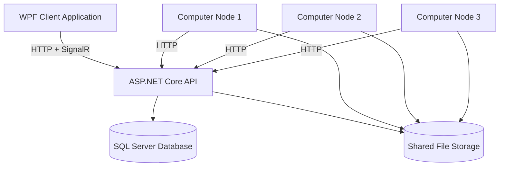

# VC Development Tool - Technical Specification

## Purpose
VC Development Tool is a distributed task processing system for Visual Computing workflows that coordinates file processing across multiple nodes with locking mechanisms.

## High-level architecture diagram


## Entry points
### CLI
* `launch.ps1` - Build and launch client application
* `start-api.ps1` - Start the API server
* `start-client.ps1` - Start the client application
* `clear-locks.ps1` - Clear file locks in the database
* `inspect-db.ps1` - View database contents
* `nuke-db.ps1` - Reset the database

### HTTP/Services
* `/api/tasks` - Task management endpoints
* `/api/nodes` - Node registration and management
* `/api/filelocks` - File lock acquisition and release
* `/api/updates` - Application updates and versioning
* `/api/health` - Health check endpoint
* `/api/debug` - Debug information and logging
* `/debugHub` - SignalR hub for real-time debugging

## Main runtime loop
1. API starts and initializes database, controllers, and SignalR hubs
2. Client connects to API and registers as node with unique hardware identifier
3. User creates tasks through client interface
4. API assigns tasks to available nodes based on health status
5. Nodes acquire file locks before processing to prevent conflicts
6. During processing, status updates are sent back to API and shown in UI
7. Locks are released upon completion or failure
8. SignalR provides real-time status updates to all connected clients

## Data flow & state
### Persistent storage
| Storage | Reader/Writer Modules | Schema |
|---------|------------------------|--------|
| SQL Server Database | AppDbContext | Entity Framework Code-first migrations |
| Shared File System | TaskService | File path-based access |
| slackconfig.json | SlackNotificationService | Simple JSON with webhook URL |

### In-memory queues/channels
| Producer | Consumer |
|----------|----------|
| DebugController | DebugHub → All connected clients |
| TaskService | NodesController → Assigned nodes |

## External dependencies
| Package | Purpose |
|---------|---------|
| Microsoft.EntityFrameworkCore.SqlServer @ latest | SQL Server database access |
| Microsoft.AspNetCore.SignalR @ 9.0.4 | Real-time communication |
| Microsoft.AspNetCore.SignalR.Client @ 9.0.4 | Client-side real-time communication |
| Squirrel.Windows @ 2.0.1 | Application updates and installation |
| System.Net.Http.Json @ 9.0.3 | JSON HTTP client |

## Config & secrets
| Config | Purpose |
|--------|---------|
| ConnectionStrings:DefaultConnection | SQL Server connection string |
| Kestrel:Endpoints:Http:Url | API server binding address and port |
| ApplicationUpdates:LatestVersion | Current application version |
| ApplicationUpdates:PackagePath | Path to update package |
| SlackSettings.WebhookUrl | Slack notification webhook URL |

## Build & run instructions
### Windows 11
```powershell
# Clone repository
git clone <repository-url>
cd VC-Dev-Tool

# Build and run API
dotnet build VCDevTool.API/VCDevTool.API.csproj
dotnet run --project VCDevTool.API/VCDevTool.API.csproj

# In another terminal, build and run client
dotnet build VCDevTool.Client/VCDevTool.Client.csproj
dotnet run --project VCDevTool.Client/VCDevTool.Client.csproj

# Alternatively, use the provided scripts
.\start-api.ps1
.\start-client.ps1

# Or build and launch with a single script
.\launch.ps1
```

### Ubuntu 22.04
```bash
# Install .NET 9.0 SDK
wget https://dotnet.microsoft.com/download/dotnet/scripts/v1/dotnet-install.sh
chmod +x dotnet-install.sh
./dotnet-install.sh --channel 9.0

# Clone repository
git clone <repository-url>
cd VC-Dev-Tool

# Build and run API (note: client is Windows-only)
dotnet build VCDevTool.API/VCDevTool.API.csproj
dotnet run --project VCDevTool.API/VCDevTool.API.csproj
```

## Known TODOs / tech-debt comments
No explicit TODO or FIXME comments found in the codebase.

## Open questions
1. How is authentication and authorization handled between nodes and the API server?
2. What specific Visual Computing workflows are supported beyond the task types enumerated in `TaskModels.cs`?
3. What are the timeout settings for file locks and how are stale locks handled across multiple nodes?
4. How is error recovery handled if a node fails during processing?
5. What is the protocol for adding new task types to the system? 